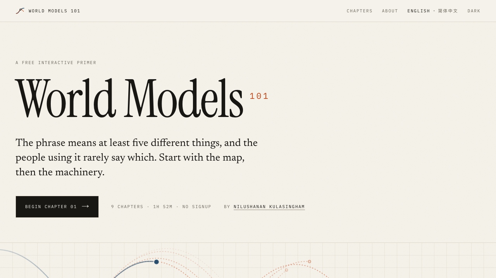

# World Models 101

A free, interactive course on how machines learn to predict, simulate, and plan.

[Read the course](https://worldmodels101.com) · [Star the repository](https://github.com/NiluK/worldmodels101)

[](https://worldmodels101.com)

The phrase "world model" now describes at least five different classes of
system, and the people using it rarely specify which. World Models 101 sorts
that out first, then teaches the machinery.

Nine chapters. About two hours. No signup. Every chapter has an interactive and
a printable PDF.

## What people mean by world model

| Definition | Predicts | Examples |
|---|---|---|
| Renderer | Pixels | Genie 3, Sora, GameNGen |
| Simulator | Geometry and physics | Marble, NVIDIA Cosmos* |
| Controller | Compact state | Dreamer, PlaNet, Ha and Schmidhuber |
| Representation | Embeddings | V-JEPA 2, I-JEPA |
| Implicit model | Nothing; researchers find it rather than run it | Othello-GPT |

\* Cosmos straddles Renderer and Simulator. That ambiguity is the point. Before
asking whether something is a world model, ask what it predicts and what you can
do with the why-prediction-is-learning.

## The course

| | Chapter | The thing you can poke |
|---:|---|---|
| 01 | [What Is a World Model?](https://worldmodels101.com/chapters/what-is-a-world-model) | A map of five definitions and the question that separates them |
| 02 | [How Do World Models Work?](https://worldmodels101.com/chapters/how-do-world-models-work) | A planner that gets worse as it searches harder inside a flawed model |
| 03 | [Why Is Prediction the Same as Learning?](https://worldmodels101.com/chapters/why-prediction-is-learning) | Possible futures collapsing as new evidence arrives |
| 04 | [What Is Latent Space?](https://worldmodels101.com/chapters/what-is-latent-space) | A two-number space that decodes into a room |
| 05 | [What Is a Dynamics Model?](https://worldmodels101.com/chapters/what-is-a-dynamics-model) | One model run with corrections, then left to consume its own output |
| 06 | [Can an AI Learn Inside Its Own World Model?](https://worldmodels101.com/chapters/can-ai-learn-inside-a-world-model) | The point where cheaper imagined experience becomes worse experience |
| 07 | [What Is JEPA, and Why Not Predict Pixels?](https://worldmodels101.com/chapters/what-is-jepa) | Two possible futures and the impossible blur that scores above both |
| 08 | [Are Video Models World Simulators?](https://worldmodels101.com/chapters/are-video-models-world-simulators) | One starting frame and three futures selected by an action |
| 09 | [What Is Still Broken in World Models?](https://worldmodels101.com/chapters/what-is-still-broken) | A thousand-step rollout showing which properties fail first |

The chapters are ordered for learning rather than history. Each one states which
definition of world model is in use, cites the underlying papers, and ends with
a short quiz. You can read the whole course online or download any chapter as a
PDF from its page.

## Run it locally

```bash
pnpm install
pnpm dev
```

The production checks are:

```bash
pnpm lint
pnpm build
```

## Print and PDF

Every chapter has a print layout. Interactive controls disappear, quizzes become
static questions with an answer key, and unrevealed sections remain visible.

```bash
pnpm dev                         # in another shell
pnpm pdf what-is-a-world-model 1
```

The command writes to `public/pdf/`. A chapter page links its PDF automatically
when the corresponding file exists.

## Design rules

**Colour carries meaning.** Vermilion marks what a model imagined. Slate marks
what happened. Neither colour is available for decoration.

**Contrast is a contract.** Every text token clears WCAG AA on the background
where it appears. Muted text must also stay visibly separate from body text, or
the reading hierarchy collapses. The contrast notes live at the top of
`src/app/globals.css`.

**State never depends on dimmed text.** Lowering text opacity can break contrast.
Active states add emphasis instead.

## Sources and corrections

Videos come from the lab that built the system or a researcher who authored the
work. Every YouTube ID is checked against the oEmbed endpoint before it ships.
Claims that cannot be independently verified are attributed rather than stated
as fact.

Technical corrections, translation fixes, and broken demos are worth reporting.
[Open an issue](https://github.com/NiluK/worldmodels101/issues). Corrections are
credited.

## License and attribution

The application code and course material in this repository are licensed under
[CC BY-SA 4.0](LICENSE). Reuse must credit Nilushanan Kulasingham and World
Models 101, identify changes, and keep adaptations under the same license.
